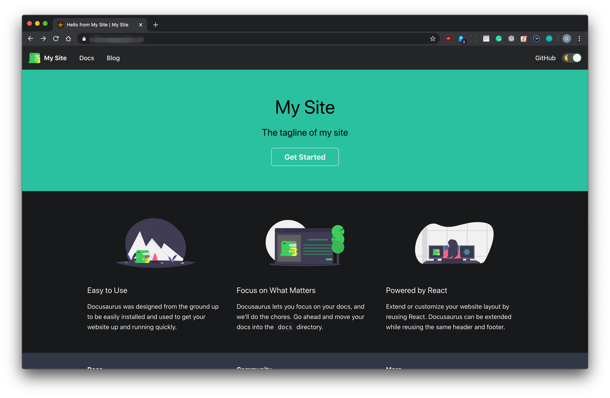

# docker-docusaurus


## What is Docusaurus

I'd like to quote the [official website](https://v2.docusaurus.io/).
> Docusaurus makes it easy to maintain Open Source documentation websites.

## What this project provided for

I hope this project would be useful for those who uses docker for building their server.

## Features

### Core packages
I chose Alpine Linux for make it a **light-weight** service.
And I do choose node-alpine as its base image for the sake of some tweaks of Nginx version.

So this is composed of,

* Alpine Linux 3.12
* Node.js 1.15.3

with,

* The latest Docusarus

'x' at the last of their version means that they could be upgraded by their maintainer.

### Docusaurus 2

This image runs Docusaurus 2 alpha rather than stable Docusaurus 1. Docusaurus 2 is developing very actively nowadays, so I hope that will be released soon.

I saw that there will be some migration jobs needed when a user upgrades whose Docusarus 1 to Docusaurus 2. So, at this moment I think it is reasonable to publish using Docusaurus 2.

But, as this is an alpha version, I put a automatic update trigger into this image. This can be disabled by setting environment variable like `AUTO_UPDATE=false`. This feature is enabled by default.

### Keep backing-up your docs

This is highly recommended that keeping backing-up your docs, always. For the several reasons, like, this is currently alpha version, or this Docker image's corruption and/or not matured yet, or physically damage, ... You have to back-up your data into your safe place.

### Working screenshot



## How can I use this

First of all, it assumes that you have installed Docker on your system.

Pull the image from docker hub.

```bash
docker pull vivumlab/docusaurus
```

### Basic usage

You can just dry run it out with the following command. The '--rm' option removes container when you terminate the interactive session.

```bash
docker run -it --rm \
-p 80:80 \
-v /where/docusaurus/config/locates:/docusaurus \
awesometic/docusaurus
```

Then you have made a website accessible using 80 port with,
- that website sources having UID 1000 and GID 1000 for non-root editing
- auto updating enabled
- being named "MyWebsite"
- having "classic" template
- changeable run mode development or production

If you want to run this image as a daemon with your parameters, try to the followings.

```bash
docker run -d --name=docusaurus \
-p 80:80 \
-v /where/docusaurus/config/locates:/docusaurus \
-e TARGET_UID=1000 \
-e TARGET_GID=1000 \
-e AUTO_UPDATE=true \
-e WEBSITE_NAME=Awesometic \
-e TEMPLATE=classic \
-e RUN_MODE=development \ 
awesometic/docusaurus
```

Then when the container runs, just let your browser browses:

``` http
http://localhost/
```

## License

This project comes with MIT license. Please see the [license file](LICENSE).
